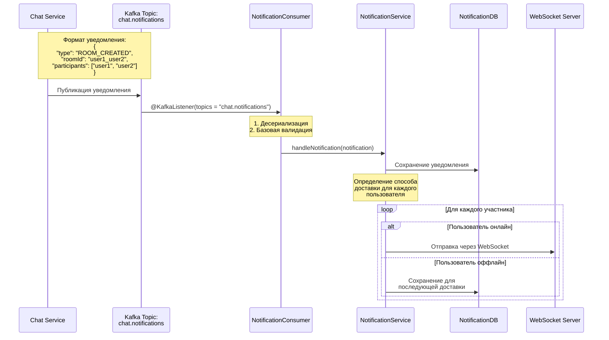

```mermaid
sequenceDiagram
    participant ChatS as Chat Service
    participant Kafka as Kafka Topic:<br/>chat.notifications
    participant NotifConsumer as NotificationConsumer
    participant NotifService as NotificationService
    participant DB as NotificationDB
    participant WS as WebSocket Server

    Note over ChatS,Kafka: Формат уведомления:<br/>{<br/>  "type": "ROOM_CREATED",<br/>  "roomId": "user1_user2",<br/>  "participants": ["user1", "user2"]<br/>}

    ChatS->>Kafka: Публикация уведомления
    Kafka->>NotifConsumer: @KafkaListener(topics = "chat.notifications")
    
    Note over NotifConsumer: 1. Десериализация<br/>2. Базовая валидация

    NotifConsumer->>NotifService: handleNotification(notification)
    NotifService->>DB: Сохранение уведомления
    
    Note over NotifService: Определение способа<br/>доставки для каждого<br/>пользователя

    loop Для каждого участника
        alt Пользователь онлайн
            NotifService->>WS: Отправка через WebSocket
        else Пользователь оффлайн
            NotifService->>DB: Сохранение для<br/>последующей доставки
        end
    end
``` 