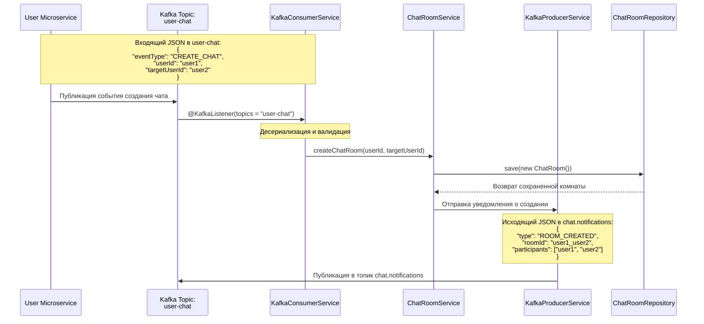
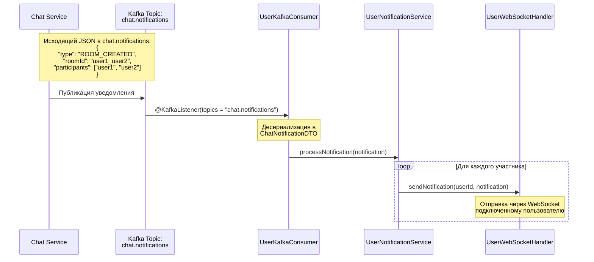

# Процесс создания и удаления чата между пользователями

Данная диаграмма описывает процесс взаимодействия между микросервисами при создании и удалении чата между пользователями.

## Описание потока

1. User Microservice инициирует событие, отправляя JSON-сообщение в Kafka топик "user-chat"
2. KafkaConsumerService прослушивает этот топик и обрабатывает входящие события
3. При получении события выполняется:
   - Проверка сообщения на null
   - Десериализация JSON в объект UserEventDTO
   - Валидация обязательных полей (eventType, userId, targetUserId)
4. В зависимости от типа события (CREATE_CHAT или DELETE_CHAT) вызывается соответствующий метод ChatRoomService
5. ChatRoomService выполняет бизнес-логику:
   - Валидирует ID пользователей
   - Генерирует ID комнаты
   - Сохраняет или удаляет запись в базе данных через ChatRoomRepository

## Задействованные файлы

- `KafkaConsumerService.java` - обработка Kafka событий и их маршрутизация
- `ChatRoomService.java` - бизнес-логика управления чат-комнатами
- `ChatRoomRepository.java` - взаимодействие с базой данных

